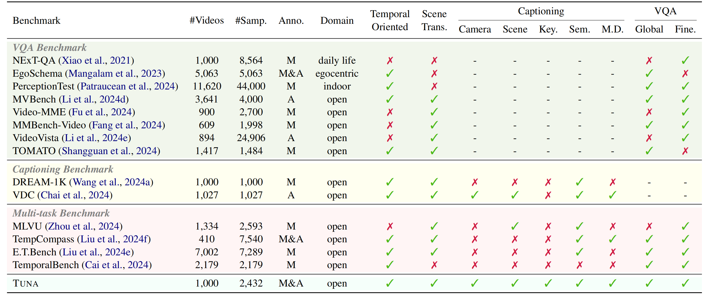
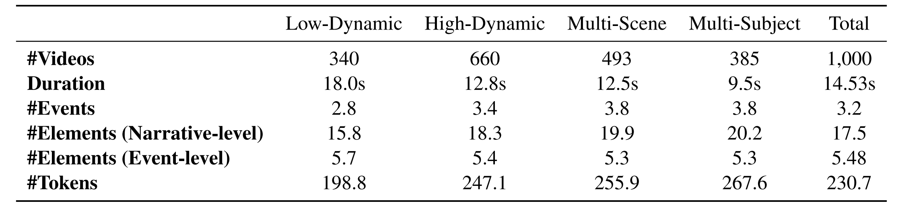

# TUNA: Comprehensive Fine-grained Temporal Understanding Evaluation on Dense Dynamic Videos (ACL 2025 Main)

[-b31b1b.svg)]()  [-yellow)](https://huggingface.co/datasets/)

## 👀 Overall

Videos are unique in their integration of temporal elements, including camera, scene, action, and attribute, along with their dynamic relationships over time. However, existing benchmarks for video understanding often treat these properties separately or narrowly focus on specific aspects, overlooking the holistic nature of video content. To address this, we introduce TUNA, a temporal-oriented benchmark for fine-grained understanding on dense dynamic videos, with two complementary tasks: captioning and QA. Our TUNA features diverse video scenarios and dynamics, assisted by interpretable and robust evaluation criteria. We evaluate several leading models on our benchmark, providing fine-grained performance assessments across various dimensions. This evaluation reveals key challenges in video temporal understanding, such as limited action description, inadequate multi-subject understanding, and insensitivity to camera motion, offering valuable insights for improving video understanding models.

    
     
    Comparison with various video understanding benchmarks across several aspects: number of videos (<b>#Videos</b>); number of samples (<b>#Samp.</b>); annotation method (<b>Anno.</b>, with M/A denoting manual/automatic); domain (<b>Domain</b>); temporal orientation (<b>Temporal Orientated</b>); presence of scene transitions (<b>Scene Trans.</b>); consideration of camera (<b>Camera</b>) and scene (<b>Scene</b>); use of keypoints (<b>Key.</b>) for controllability and interpretability; Judgement of semantically identical yet diverse representations (<b>Sem.</b>); availability of multi-dimensional scores (<b>M.D.</b>); if global (<b>Global</b>) and fine-grained (<b>Fine.</b>) understanding are concerned.

## 🔍 Dataset

    
     
    Detailed statistics for , including: number of videos (<b>#Videos</b>), video duration (<b>Duration</b>), number of events (<b>#Events</b>), number of visual elements in captions (<b>#Elements (Narrative-level)</b>), number of visual elements in events (<b>#Elements (Narrative-level)</b>), number of tokens of caption (<b>#Tokens</b>).

## ⚖ Evaluation

We are organizing the paper, data and code, which are expected to be released this month.
